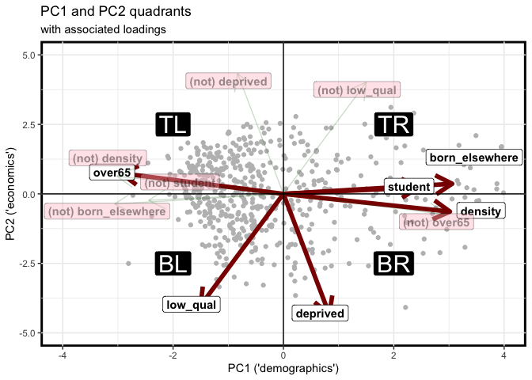
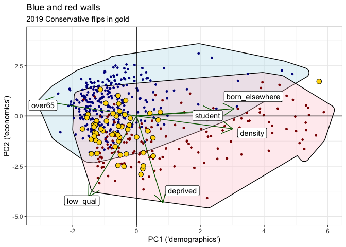
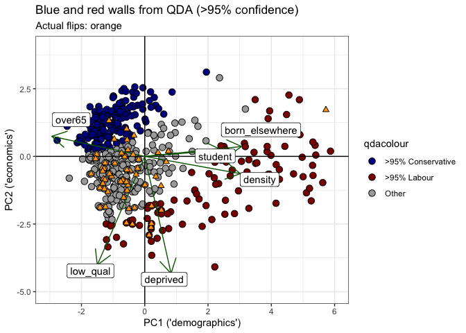
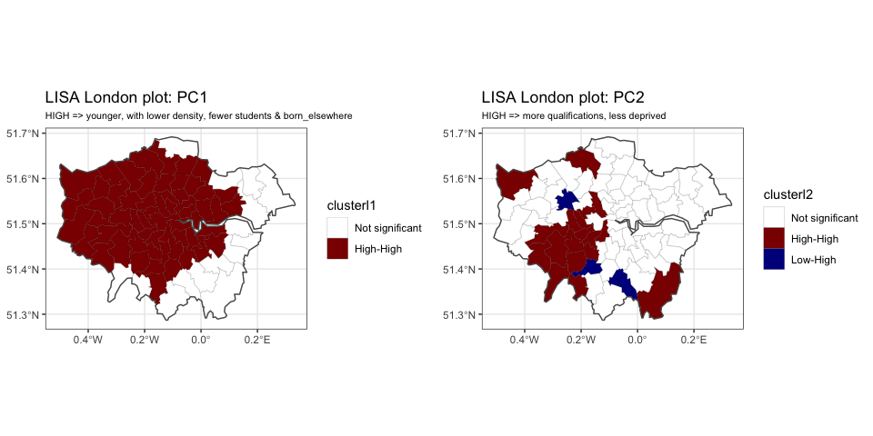
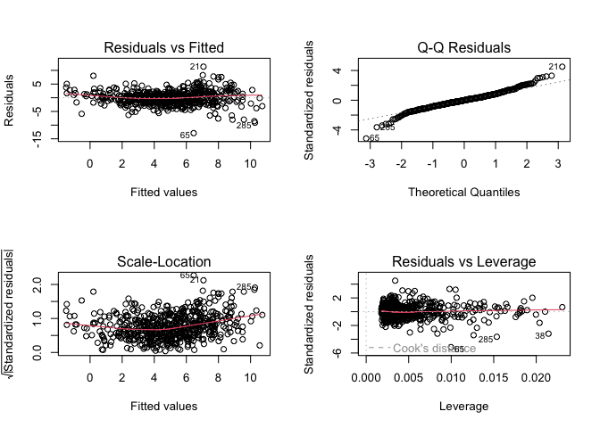
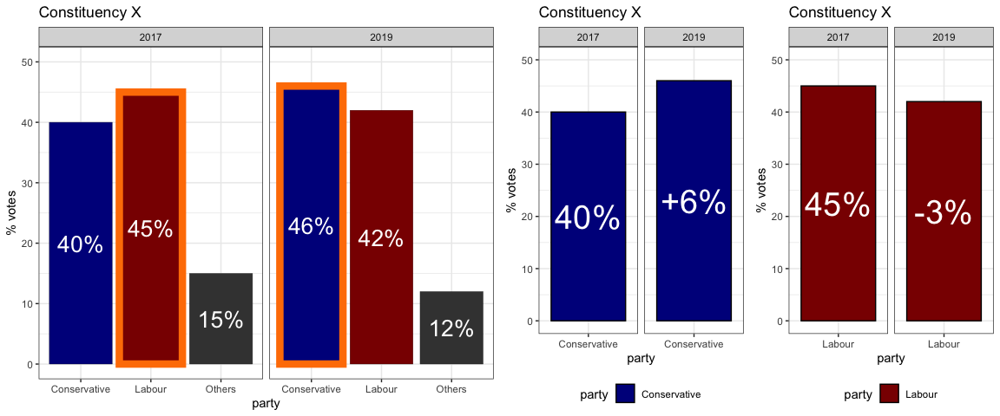
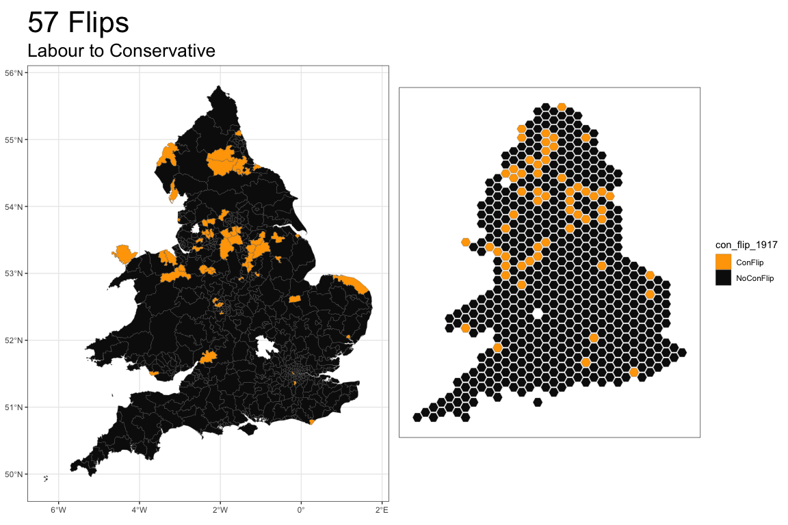

<!-- README.md is generated from README.Rmd. Please edit that file -->

## Flips and swings

The aim of this study is to examine the geographic effects of different
census-based variables on the collapse of Labour’s support in the 2019
UK general election. It seeks to examine whether these effects are
consistent for different locations across the UK and for varying
categories of constituency on a rural-urban spectrum, and if not, to
describe this spatial heterogeneity.

The poor performance of Labour in the election is commonly referred to
as the collapse of Labour’s “*red wall*’. This referred to the
impression that voters in a collection of constituencies, which had been
reliably supportive of Labour for many years, had switched their
allegiance in 2019 to the Conservatives. Such seats were exclusively in
England and Wales. As a results, Scotland and Northern Ireland have been
excluded from the study because the primary contests in those nations
are not directly between the Conservatives and Labour as they are in the
majority of constituencies of England and Wales.

Firstly, this study will define what this “*red wall*” might mean in
concrete terms, rather than as a phenomenon commonly applied in
newspaper headlines. The results will be analysed in terms of the binary
outcome of a seat “*flipping*” or “*not flipping*”, where these phrases
refer to the Conservatives taking, or failing to take, seats which
Labour held from the previous election of 2017.

Following this, the study extends beyond the flipping of seats to
examine a continuous variable, the “*swing*”, which measures on a
constituency-by-constituency basis the extent of switching from one
party to another.

### Data

The electoral and census data is sourced from the `parlitools` package
in R. The electoral data is the published results of the 2019 elections,
in addition those from 2017, 2015 and 2010. This information is combined
with information from the 2011 census, aggregated to the level of
Westminster constituencies, which provides a host of information about
the demographic and economic composition of each constituency. It
features 191 variables, from which six have been selected as being
representative. These variables are:

| Variable name    | Composition                                                                    |
|-----------------------|-------------------------------------------------|
| `low_qual`       | % of population whose highest qualification is ‘no qualification’ or ‘level 1’ |
| `deprived`       | % of population categorised as exhibiting levels 1-4 of deprivation            |
| `over65`         | % of population aged 65 or over                                                |
| `born_elsewhere` | % of population born outside of the UK                                         |
| `student`        | % of population registered as students                                         |
| `density`        | number of people per square unit                                               |

Variables derived from 2011 census

Finally, one of seven categories is applied to each constituency placing
it in a position on a spectrum ranging from `Village or smaller`, via
`medium towns` and `non-core cities`, to `core cities` and `London`.
This data comes from a research briefing called “*City & Town
Classification of Constituencies & Local Authorities*”, published in
2018 by the House of Commons Library, which estimates the percentage of
each constituency which falls into each category. For this study, the
category which is largest in each constituency is attributed to the
whole constituency.

Throughout the study, `con_19` will refer to the percentage of
legitimate votes which were cast for the Conservatives (along with
equivalent variables such as `con_17`, `lab_19` and `lab_17`). The
measure of swing which will be used is called the “*Butler swing*”,
hereafter abbreviated to `con_swing`, and is calculated as follows:

The resultant variable should be interpreted as the swing from Labour to
the Conservatives between the 2017 and 2019 general elections.

### Covariate correlations

As is the case with many socio-economic indicators, it is important to
understand that high degrees of correlation can prove problematic for
modelling. The degree of correlation between the variables under
consideration are shown below.

It is also interesting to examine the differences between the
correlations of `con_19` and `con_swing` with the explanatory variables.

For most of these, the correlation with `con_swing` is simply a milder
version of that with `con_19.` This would be consistent with a situation
where those who are changing their vote from Labour to Conservative, and
thus causing the swing, are of a similar demographic and economic
make-up to those who were already voting for the Conservatives. For
`over65`, the drop is quite large, suggesting that most of those
`over65` who would vote for the Conservatives were already doing so
before 2019.

The correlations with `low_qual` and `deprived`, however, show quite
different behaviour. `low_qual` has essentially no correlation with
`con_19` but is strongly positively correlated with `con_swing`.
`deprived` has a strong negative correlation with `con_19` but an
equivalently large positive correlation with `con_swing`.

The processes behind these observations, and their consequences for the
election outcome in 2019, are the subject of this study.

As many are of the census covariates are highly correlated and liable to
cause multicollinearity issues in regression modelling, it was decided
to perform PCA and restrict the examination to the first two independent
(by construction) components. This will also enable visual evaluation of
potential walls on a two-dimensional principal component plane, while
maintaining as much information as possible from all of the covariates.

### PCA quadrants

The following tables show that the first two components of the PCA
contain 81% of the variation present in the covariates.

`PC1` broadly represents `over65`, `density`, `students`,
`born elsewhere` - a collection of demographic variables.

`PC2` broadly represents `low qualifications`, `deprived` - variables
associated with economic/educational situations.

    #>                             PC1      PC2       PC3       PC4       PC5
    #> Standard deviation     1.772089 1.313666 0.7797942 0.5466253 0.4188123
    #> Proportion of Variance 0.523380 0.287620 0.1013500 0.0498000 0.0292300
    #> Cumulative Proportion  0.523380 0.811000 0.9123500 0.9621500 0.9913800
    #>                              PC6
    #> Standard deviation     0.2273818
    #> Proportion of Variance 0.0086200
    #> Cumulative Proportion  1.0000000
    #>                  PC1   PC2   PC3   PC4   PC5   PC6
    #> over65         -0.49  0.12 -0.08 -0.84 -0.15 -0.09
    #> low_qual       -0.25 -0.67  0.00  0.14 -0.09 -0.68
    #> deprived        0.14 -0.72 -0.08 -0.23 -0.10  0.63
    #> student         0.41  0.04 -0.88 -0.11 -0.04 -0.21
    #> density         0.50 -0.11  0.31 -0.43  0.63 -0.25
    #> born_elsewhere  0.51  0.06  0.34 -0.17 -0.75 -0.18

When these are displayed as a bi-plot, it is possible to think of each
of these constituencies as living in one of four quadrants, divided
according to differing demographic, economic and educational structures.

| Quadrant          | Characteristics                            |
|-------------------|--------------------------------------------|
| Top-Left (TL)     | older, low density, wealthy                |
| Top-Right (TR)    | younger, high density, high qualifications |
| Bottom-Left (BL)  | older, low density, low qualifications     |
| Bottom-Right (BR) | younger, high density, high deprived       |

Predominant characteristics of each quadrant

## Flips

### 1. Global wall

If a *wall* means anything in the electoral sense, it suggests something
that is resistant to change, opposes movement. In this study, it is
defined as a collection of constituencies which have been held
consistently by one party in 2010, 2015 and 2017. Seats which match this
description for either the Conservatives or Labour are shown on the maps
below, comprising what will be referred to as blue and red walls
respectively. These walls clearly, by this definition, do not contain
seats which either party held temporarily during one or more of these
parliamentary terms.

An initial look at the blue and red walls suggests that Labour’s red
wall is quite small. From the map, we can see that the area covered by
the Conservative wall is much larger than that of the Labour wall.
However, all constituencies contain roughly the same size of population,
and Labour tends to dominate in more densely populated small
constituencies. Labour’s red wall is concentrated around the
`North East`, `North West`, `Yorkshire and the Humber`, `Wales`, and
`London`. It can be seen from the hexagon maps, which show each
constituency as having equal area, that each party has over 200 seats in
its wall.

If thought of in this way, these *walls* can be visualised in terms of
their demographic and economic characteristics by picturing them on the
principal components plane which was described earlier.

Let Labour’s red wall be defined on the PC plane of first and second
principal components, derived from the census, as the region described
by a convex hull of the location of all of the seats which have been
held by Labour continuously in 2017, 2015, and 2010. Note that these
seats have been maintained by Labour despite their having failed to gain
power in any of these elections. An analogous blue wall can be defined
for the Conservative party.

When we look at them together, in the diagram below, there is a large
intersection area. This can be interpreted as some sort of electoral
middle-ground where majorities are won and lost. The seats which flipped
from Labour to the Conservatives in 2019 are shown in gold. It is clear
that the vast majority of these flipped seats lie in the intersection
area between the Blue Wall and the Red Wall. There is one extreme
outlier, the constituency of Kensington, on the right of the diagram.

Separating the walls using quadratic discriminant analysis (QDA):

#### Flips by quadrant

The following shows in which PC quadrant these flips occurred.

As Kensington is a strong outlier which distorts the plot, making it
difficult to read, it is removed for the plot below, and the names of
these flipped seats are shown, coloured according to their regional
location.

In terms of PC quadrants, most of the flips occurred in the bottom-left
(BL) zone. However, all zones contain flipped seats.

#### Kensington outlier

*Kensington seems like a particularly stark outlier.*

*Kensington is a constituency in Greater London which first existed
between 1974 and 1997 and was recreated in 2010. Since 2019, it has been
represented in the House of Commons of the UK Parliament by Felicity
Buchan of the Conservative Party.*

*At the 2017 general election Emma Dent Coad gained the seat from
incumbent Conservative Victoria Borwick by the slenderest margin in
England, 20 votes, the first time Kensington had been represented by a
Labour MP. Dent Coad was defeated by Buchan at the 2019 United Kingdom
general election by the narrow margin of 150 votes.*

*Just days after Dent Coad’s election, the Grenfell Tower fire took
place in her then constituency. On 16 June, she blamed the Kensington
and Chelsea council for failings which led to the fire.*

*Kensington is mostly residential — housing varies between the expensive
apartments with manicured garden squares or terraces of South
Kensington, that has some of the most exclusive real estate in the world
and, by contrast, North Kensington and Ladbroke Grove have, for the most
part, dense social housing, tower blocks in output areas with high
rankings in the 2000-compiled Index of Multiple Deprivation.*

#### Beyond a global wall

The description above of global walls may not capture the subtleties of
electoral behaviour adequately. While a certain set of economic and
demographic components may be associated with higher levels of
Conservative or Labour votes in one region of England and Wales, they
might be associated with different outcomes in other regions. Similarly,
there may be different associations when these PC components are grouped
by degree of peripherality (position on the rural-urban spectrum).

To examine this, different red and blue walls are shown below. They keep
the same definition of a wall but apply the construction of convex hulls
separately for each category of constituency in terms of its rural-urban
make-up, or its region.

### 2. Periphery-core walls

The walls below are constructed according to each of the seven
categories from `village or smaller` to `core city (London)`.

Almost all seats flipped in a `rur_urb` red wall context (not
overlapping with a blue wall) were in the `West Midlands`, predominantly
in `medium` and `large towns`, and `other (non-core) cities`

Most of the out of blue wall flips were in large towns and non-core
cities in the `West Midlands`.

### 3. Regional walls

The same process is repeated below but, this time, walls are constructed
by region.

When looking at **regional red walls**, there are many more flips
occurring outside of the intersection areas with the blue wall. This
especially occurred in the `North East`, `North West`, `Wales`,
`West Midlands`, and `Yorkshire and the Humber`.

The flips which occurred in the `East` were never part of the local red
wall, while those that changed hands in the `East Midlands` were very
much in a PC-space well-populated by Conservative blue wall seats.

Perhaps the above is the starkest view so far of how poorly Labour
performed relative to the Conservatives in the 2019 election among their
core electorate. It shows outside-of-intersection flips occurring in
many large towns in `Yorkshire and the Humber`, `non-core cities` in the
`West Midlands`, and a cross-section of categories in `Wales` and the
`North West`. In the `North East`, all of the many flips occurred in a
space not at all contiguous with traditional conservative seats in that
region.

### Proportional Dominance Quadrants

Beyond counting the number of flipped seats, the degree of collapse of
Labour’s red wall can be viewed by examining the percentage of seats won
by the Conservatives in each `region`, `rur_urb` category, and
`PC quadrant`, and how this changed in the 2019 election. The plots
below show these movements, and the size of the movement in each
category is shown by the blue arrows. Only seats which were held in 2017
by Labour or the Conservatives are included in the construction of these
measures.

These charts show, for example, that in `villages or smaller`, the
Conservatives already had complete dominance in the TL quadrant. In the
TR zone, with higher qualification levels and a younger population, they
attained 100% dominance in `Wales`, and close to that in the
`North East`.

The BR quadrant is the furthest from the blue wall. Here, they made
large proportional gains in `medium` and `large towns`, in addition to
`non-core` and `core cites`, in the `West Midlands`. Large gains also
occurred in this quadrant in `large towns` in the `East`and the
`West Midlands`, and in `non-core cities` in the `North West` and
`West Midlands`.

Overall, most of the proportional increase in Conservative seats
relative to Labour occurred in `medium` and `large towns` (broadly
across regions and PC quadrant), followed by `non-core cities` in the
`Midlands` and `North West`. `London` has been omitted as its only flip
was Kensington.

### Geography

Finally, in terms of flips, geography is explicitly introduced below by
showing these flipped seats in their spatial positions, coloured
according to the quadrant in which they lie. It shows that the types of
flips which occurred are somewhat grouped, displaying a spatial
relationship. This is developed further in the next section where the
swing itself from Labour to Conservative, rather than simply whether or
not it led to a seat flip, is modelled. These models will explicitly
feature spatial structure, and its contribution to the process.

## Swings

The flipping of seats from Labour to Conservative is a simplified,
binary way of looking at the deterioration in Labour’s performance in
the 2019 election. Whether or not a flip occurs is not only influenced
by the demographic and economic make-up of a constituency, its
urban-rural structure, and the region where it is located. It also
depends on how large the difference was between Labour and Conservative
votes in the previous election. It is possible to win a huge number of
extra votes in a constituency but still not flip a seat, or to increase
vote-share by a very meagre amount in order to overcome a slim majority.

The table below shows that only four of the highest ten constituency
swings resulted in a flipped seat. This would imply that examining the
swings is more informative than merely looking at the flips to
understand the poor Labour performance.

    #> Simple feature collection with 10 features and 6 fields
    #> Geometry type: MULTIPOLYGON
    #> Dimension:     XY
    #> Bounding box:  xmin: -2.212514 ymin: 52.49186 xmax: -0.0405247 ymax: 54.64483
    #> Geodetic CRS:  WGS 84
    #> # A tibble: 10 × 7
    #>    constituency_name region                   rur_urb    con_swing con_flip_1917
    #>    <chr>             <chr>                    <fct>      <chr>     <chr>        
    #>  1 "Bassetlaw"       East Midlands            Medium To… 18.42%    ConFlip      
    #>  2 "Dudley North"    West Midlands            Large Town 15.75%    ConFlip      
    #>  3 "Mansfield"       East Midlands            Large Town 15.49%    NoConFlip    
    #>  4 "Redcar"          North East               Medium To… 15.46%    ConFlip      
    #>  5 "Leicester East"  East Midlands            Other City 15.3%     NoConFlip    
    #>  6 "Great Grimsby"   Yorkshire and The Humber Large Town 14.69%    ConFlip      
    #>  7 "Wentworth and D" Yorkshire and The Humber Medium To… 14.24%    NoConFlip    
    #>  8 "Doncaster North" Yorkshire and The Humber Small Town 13.66%    NoConFlip    
    #>  9 "Stoke-On-Trent " West Midlands            Other City 13.43%    NoConFlip    
    #> 10 "Normanton, Pont" Yorkshire and The Humber Medium To… 13.42%    NoConFlip    
    #> # ℹ 2 more variables: geometry <MULTIPOLYGON [°]>, swing_rank <int>

The *swing*, as described in the introduction, is a measure of the
difference between the change in the Conservative vote from one election
to the next, and the corresponding change for Labour. The different
levels of swing across England and Wales can be modelled as a function
of the PC variables, as before, but the modelling can also take into
account geographic factors and the peripherality measure captured in the
`rur_urb` category.

Firstly, a neighbourhood weights matrix is defined, for use in the
geo-spatial part of the model. This matrix defines a constituency as
being a contiguous neighbour to another if they share at least one point
on their boundaries. Some slight adjustments need to be made to allow
islands to participate in the structure. This is achieved by introducing
a buffer of 6km on boundary lines, which is adequate to cover the
distance across the Solent to the Isle of Wight.

### Exploratory Analysis

Looking at the map of the `con_swing` variable, it is clear that the
results of the 2019 election strongly favoured the Conservatives
compared to Labour, relative to the 2017 outcome. It is reflective of
some of the patterns seen previously when looking at flipped seats. The
highest swings are in areas of the `North East`, `North West`,
`Yorkshire and the Humber`, `East Midlands`, `West Midlands`, `Wales`,
and parts of `London`. There are areas with generally low or negative
swings scattered throughout these regions too.

It is clear from a visual inspection that there is spatial
autocorrelation at play. This is confirmed by calculating the global
Moran’s-I statistic, as shown below.

By looking closer and calculating a local Moran’s-I for each
constituency (LISA analysis), a number of significant hot-spots and
cold-spots can be identified. These are mapped below. Hot-spots are
areas of high swing which are surrounded by areas of high swing, and
cold-spots are the equivalent but with low swing.

Equivalent LISA plots are shown below for the covariates PC1 and PC2.

There are two large hot-spots along the east coast, north of the Wash,
and a cold-spot region around and to the south-west of `London.` There
are also a number of much smaller cases, particularly in the
`North-West`, `Yorkshire and the Humber`, and the `West Midlands`. A
number of Low-High and Hig-Low regions can also be identified, we
strongly high or low levels of swing, but neighbouring areas with the
opposite measure, particularly in the `North East`, `West Midlands`, and
`London`. The following models will investigate these phenomena in more
detail.

## Supplemental images and figures used in presentation

#### Regions image

#### Rural-urban image

#### Model 0 - SLR

A simple linear regression of `con_swing` on `PC1` and `PC2`.
Examination of the residuals shows a high degree of spatial correlation.

    #> 
    #> Call:
    #> lm(formula = con_swing ~ PC1 + PC2, data = df)
    #> 
    #> Residuals:
    #>      Min       1Q   Median       3Q      Max 
    #> -12.9246  -1.4542  -0.0168   1.3385  11.3583 
    #> 
    #> Coefficients:
    #>             Estimate Std. Error t value Pr(>|t|)    
    #> (Intercept)  4.94651    0.10564   46.83   <2e-16 ***
    #> PC1         -0.66766    0.05966  -11.19   <2e-16 ***
    #> PC2         -1.49695    0.08049  -18.60   <2e-16 ***
    #> ---
    #> Signif. codes:  0 '***' 0.001 '**' 0.01 '*' 0.05 '.' 0.1 ' ' 1
    #> 
    #> Residual standard error: 2.524 on 568 degrees of freedom
    #> Multiple R-squared:  0.4534, Adjusted R-squared:  0.4515 
    #> F-statistic: 235.6 on 2 and 568 DF,  p-value: < 2.2e-16

#### Flip and swing graphics

#### Map of flips

#### Map of swings

#### Hanretty Brexit map

